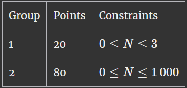
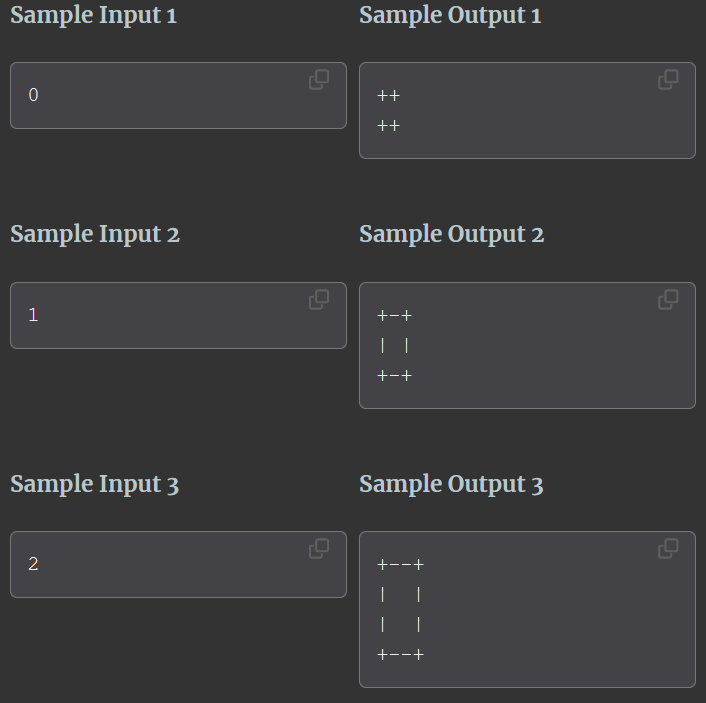

# ASCII kassi

Task from [kattis.com](https://open.kattis.com/problems/asciikassi). 
Which I have solved using Python, C & C++. 

The task at hand involves drawing a square in the output, using only the symbols |, -, + and spaces.
The left and right sides of the square should be drawn using the symbol |, while the top and bottom sides of the should be drawn using the symbol -. Corners should be drawn using the symbol + and the interior of the square should be made up of spaces.

## Input

The first and only line in the input contains a single integer N, representing the interior sidelength of the square.

## Output

Output a square of size NxN. Note that the number of spaces in the output must be exactly correct and if there are any spaces outside the square then your solution will be considered incorrect.

## Scoring

## Inputs & Outputs

