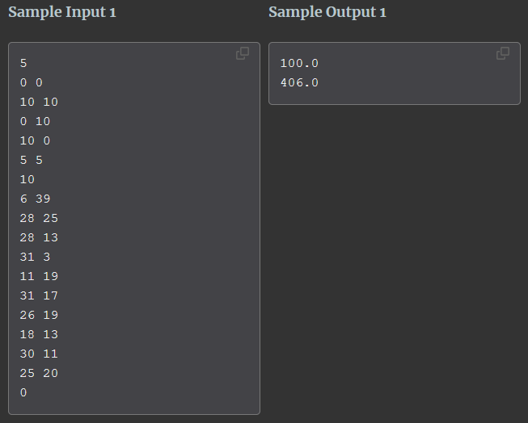

# Robot Protection

You are developing a new robotic guard that can wander around and look for suspicious activity in your home. The robot is small and not smart enough to maneuver by itself. Instead, you set up fixed-location beacons in the region you want it to protect. The robot is programmed to walk toward a single beacon, any beacon, in a straight line. When it reaches a beacon, it turns and walks towards another beacon, chosen at random. It can also stop and change course at any time, not just when it reaches a beacon. It does this all day long, relaying surveillance information to a master computer. In this way, it covers a lot of ground.

Given a configuration of beacons, your job is to determine the area that the robot can patrol. You should assume that the robot starts at the first beacon of the configuration.

## Input

Input consists of up to 30 configurations of beacons. Each configuration starts with a line containing the number of beacons, 1 <= n >= 10000. The next n lines each describe one beacon with two integers xy, where both are in the range [-10000, 10000]. Input ends when n is 0.

## Output

For each configuration of beacons, output the area the robot has to patrol. Your answer should be accurate to within 0.1 square units.

